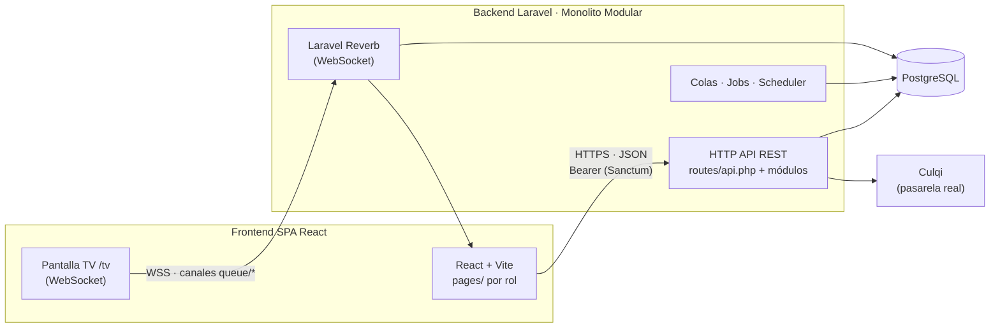
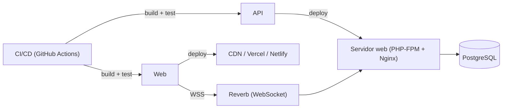

# Arquitectura del Sistema — SGCM-CMAS (Versión de Producción)

Documento que define la arquitectura del sistema real **SGCM-CMAS** que reemplazará al prototipo. Se mantiene el modelo funcional y modular ya documentado ([`MODULOS.md`](MODULOS.md), [`CASOS_DE_USO.md`](CASOS_DE_USO.md), [`MER.md`](MER.md)) y se especifica el stack de producción.

> **Stack objetivo**
>
> | Capa | Tecnología |
> |---|---|
> | Frontend | **React 18+ / Vite** (SPA, modular por feature) |
> | Backend | **Laravel 11/12** (API REST, "modular monolith") |
> | Base de datos | **PostgreSQL** |
> | Tiempo real | Laravel **Reverb** (WebSocket) + Laravel Echo (cola y TV) |
> | Autenticación | Laravel **Sanctum** (SPA) + middleware de roles/policies |
> | Tareas asíncronas | Colas Laravel (expiración de cupos, verificación de pagos, recordatorios) |
> | Pasarela de pago | Integración real **Culqi** (sustituye la pasarela simulada) |

**Decisión de arquitectura:** **monolito modular** (*modular monolith*) — no microservicios. Los módulos de negocio están delimitados en el código (misma base de datos, mismo despliegue) y pueden extraerse a microservicios en el futuro si algún módulo crece (p. ej. pagos), sin rediseñar el frontend.

---

## 1. Índice

1. [Visión general y diagrama](#2-visión-general-y-diagrama)
2. [Estructura del repositorio](#3-estructura-del-repositorio)
3. [Backend Laravel: monolito modular](#4-backend-laravel-monolito-modular)
4. [Frontend React: modular por feature](#5-frontend-react-modular-por-feature)
5. [Comunicación: REST + WebSockets + colas](#6-comunicación-rest--websockets--colas)
6. [Modelo de datos en PostgreSQL](#7-modelo-de-datos-en-postgresql)
7. [Seguridad, roles y auditoría](#8-seguridad-roles-y-auditoría)
8. [Estrategia de migración del prototipo](#9-estrategia-de-migración-del-prototipo)
9. [Despliegue](#10-despliegue)

---

## 2. Visión general y diagrama

El sistema es una **SPA React** que consume una **API REST Laravel**. La base de datos **PostgreSQL** es la única fuente de verdad. La **cola del día y la pantalla de TV** usan **WebSocket** (Reverb) para actualización en tiempo real real (a diferencia del `localStorage` + evento `storage` del prototipo).



---

## 3. Estructura del repositorio

Monorepo con dos aplicaciones (misma base que `proCitas/`):

```
proCitas/
├── backend/                    # Laravel 12 — API REST (ver docs/BACKEND.md)
│   ├── app/
│   │   ├── Http/               # Controllers/Api · Requests · Resources · Middleware
│   │   ├── Models/ · Services/ · Enums/ · Events/ · Jobs/
│   ├── routes/api.php          # contrato REST (prefijo /api)
│   ├── database/               # migrations/ · seeders/
│   └── composer.json
├── frontend/                   # React + Vite — SPA (ver docs/FRONTEND.md)
│   ├── src/
│   │   ├── api/ · auth/ · hooks/ · components/ · pages/ · styles/ · utils/
│   └── package.json
├── openapi.yaml                # Contrato de API (fuente única → cliente TS del frontend)
└── docs/                       # (ARQUITECTURA, MER, MODULOS, CASOS_DE_USO, REQUISITOS…)
```

El **contrato de API se define en `openapi.yaml`** y a partir de él se generan la documentación Scribe del backend y el cliente TypeScript del frontend.

---

## 4. Backend Laravel: monolito modular

Cada módulo del prototipo (`docs/MODULOS.md`) se convierte en un **dominio** dentro de la estructura Laravel estándar (ver `docs/BACKEND.md` Parte 3). Los límites de módulo se conservan por convención (carpetas, servicios e interfaces), sin loader de módulos propio:

```
backend/app/
├── Http/
│   ├── Controllers/Api/         # Auth · Catalog (specialties, consultorios, doctors)
│   │                            # Appointments · Triage · Queue · Payments
│   │                            # Waitlist · Admin (users, reports, settings, audit)
│   │                            # WebhookController (Culqi)
│   ├── Requests/                # Form Requests por recurso (validación)
│   ├── Resources/               # API Resources (JSON estable, no se expone el modelo)
│   └── Middleware/              # EnsureRole · ValidateCulqiWebhook
├── Models/                      # User · Patient · Doctor · Specialty · Consultorio
│                                # Appointment · Triage · Diagnosis · Payment
│                                # WaitlistEntry · AuditLog · Setting
├── Services/                    # AppointmentService · PaymentService · QueueService
│                                # WaitlistService · AvailabilityService · TriageService
│                                # ReportService · AuditService · DniService (RENIEC)
├── Enums/                       # AppointmentStatus · PaymentStatus · PaidType · WaitlistStatus …
├── Events/ · Jobs/              # AppointmentCheckedIn · TurnCalled · recordatorios
│                                # expiración de cupos · verificación de pagos · conciliación
└── Console/                     # scheduler + comandos (Kernel)
```

**Convenciones por dominio:**

- **Regla de negocio en el modelo/Servicio**: el ciclo `agendada → pagada → check_in → en_espera_triaje → en_triaje → triaje_completado → en_atencion → documentada` vive en `Appointments` como **máquina de estados** (enum `Status` + transiciones validadas). Las citas registradas por recepción entran por `confirmada → pagada` (caja). Las ramas `cancelada`, `reprogramada`, `check_in`, `atendida` se modelan con estados permitidos por transición.
- **Validación con Form Requests** por módulo (mismas reglas que el prototipo: correo único, DNI 8, celular 9, clave con política, etc.).
- **DTOs/Resources** para exponer JSON estable; **no se expone el modelo directamente**.
- **Cada dominio registra sus rutas** en `routes/api.php` con prefijo `/api` y middleware de rol por recurso.
- **Los módulos no se importan entre sí por el modelo**, sino por **interfaces/servicios** (p. ej. `Appointments` declara `PaymentPort` que implementa `Payments`) para conservar los límites modulares.

---

## 5. Frontend React: modular por feature

Se conserva la organización por **páginas/roles del prototipo** (`docs/FRONTEND.md` Parte 2) y se agregan las capas de `api`, `auth` y `hooks`:

```
frontend/src/
├── api/                         # cliente axios (tipos generados desde openapi.yaml)
├── auth/                        # AuthContext · RequireRole (guard por rol)
├── hooks/                       # useAppointments · usePayments · useQueue · useWaitlist …
├── components/                  # layout/ · ui/ (biblioteca del prototipo) · shared/
├── pages/
│   ├── public/                  # landing, login, registro, recuperar, disponibilidad
│   ├── patient/                 # reserva, mis citas, check-in móvil, historial, pagos, lista de espera, perfil
│   ├── doctor/                  # agenda, disponibilidad, diagnóstico, ficha del paciente
│   ├── nurse/                   # cola de triaje, formulario de signos, historial
│   ├── reception/               # agenda, nueva cita, check-in presencial, cobros, cancelaciones
│   ├── admin/                   # dashboard, usuarios, especialidades, consultorios, reportes, configuración
│   ├── queue/                   # tablero de la cola (recepción y enfermería)
│   └── display/                 # pantalla de TV (/tv)
├── styles/                      # tokens.css · global.css · css por página
└── utils/                       # helpers de presentación · formatos es-PE · validación DNI
```

**Gestión de estado:**
- **Estado de servidor**: TanStack Query (citas, pagos, catálogos) — cachea, revalida y maneja mutaciones.
- **Estado de cliente**: Context solo para sesión (`auth`) y UI (toasts, modales).
- **Tiempo real**: Laravel Echo suscrito a canales privados `queue.consultorio.{id}` para el tablero y `/tv`.
- **Enrutado protegido**: guards por rol (`<RequireRole role="medico">`) que consumen el rol del token.

---

## 6. Comunicación: REST + WebSockets + colas

| Canal | Uso | Tecnología |
|---|---|---|
| **REST** | Todas las operaciones CRUD y de negocio | `api/*`, JSON, Sanctum |
| **WebSocket** | Cola del día, TV, estado de la cita del paciente | Reverb + Echo (canales `queue.consultorio.{id}`, `appointment.{id}`) |
| **Colas** | Expiración de cupos de lista de espera, verificación de pagos (>15 min), recordatorios de cita, conciliación de la pasarela | Jobs + Scheduler |

**Ejemplo — flujo de check-in con tiempo real:**
1. `POST /api/reception/check-in` (recepción) sobre una cita `pagada` **o `check_in`** asigna el turno `A-00X` y la pasa a `en_espera_triaje` (el check-in móvil del paciente solo deja la cita en `check_in`; la recepción la envía a la cola).
2. `QueueService` dispara el evento `AppointmentCheckedIn` (broadcast).
3. Reverb publica en el canal `queue.consultorio.{id}` → el tablero y la TV se actualizan **en todos los dispositivos**.

---

## 7. Modelo de datos en PostgreSQL

Mapeo del [`MER.md`](MER.md) a tablas normalizadas (se eliminan los objetos embebidos del prototipo):

| Entidad MER | Tabla PostgreSQL | Notas |
|---|---|---|
| USUARIO | `users` | Tabla nativa de Laravel + columna `role` (enum) |
| PACIENTE | `patients` | FK `user_id` (en el prototipo no estaba vinculado) |
| MEDICO | `doctors` | FK `user_id`, `specialty_id`, `consultorio_id` |
| ESPECIALIDAD | `specialties` | |
| CONSULTORIO | `consultorios` | |
| — | `consultorio_specialties` | ★ tabla pivote (el prototipo usaba array) |
| MEDICO.slots | `doctor_schedules` + `doctor_date_exceptions` | ★ normalizado: plantilla semanal + días bloqueados |
| CITA | `appointments` | `status` como enum PostgreSQL; FK patient/doctor/specialty; `code` legible `C-XXXX` |
| CITA.diag | `diagnoses` | ★ normalizado: `{ appointment_id, dx, notes, doctor_id }` |
| CITA.triage | `triages` | ★ normalizado: `{ appointment_id, pa, temp, fc, peso, talla, motivo, alergias, observaciones, nurse_id, at }` |
| CITA.turno | `appointments.turno` | columna `turno` + índice único `(date, turno)` |
| PAGO | `payments` | FK `appointment_id`, `patient_id`; `paid_type` enum (`adelanto|total`), `gateway` bool, `culqi_order_id`/`culqi_charge_id` |
| LISTA_ESPERA | `waitlist_entries` | FK patient/specialty/doctor |
| LISTA_ESPERA.offer | columnas en `waitlist_entries` | ★ campos `offer_date`, `offer_time`, `offer_expires_at`, `confirm_window_min` (el prototipo usa prefijo `offer_`) |
| AUDITORIA | `audit_log` | FK `user_id` (id, ya no email desnormalizado) |
| SETTINGS | `settings` | tabla clave-valor |

**Convenciones:**
- IDs **UUID** (o `bigint`) en todas las tablas; **timestamps** auditables (`created_at`, `updated_at`) y `soft deletes` donde aplique.
- **Enums PostgreSQL** para `role`, `appointments.status`, `payments.status`, `payments.paid_type`, `waitlist_entries.status`.
- Índices para las consultas calientes: `(doctor_id, date, time)` en `appointments`, `(date, turno)`, `(patient_id, date)`.
- **`date`/`time`** tipados en PostgreSQL (el prototipo manejaba strings).
- Migraciones y seeders por módulo (el prototipo alimenta `database/seeders/` con `SPECIALTIES`, `CONSULTORIOS`, `DOCTORS`, `PATIENTS`, citas, pagos, lista de espera y auditoría).

---

## 8. Seguridad, roles y auditoría

- **Autenticación**: Sanctum (tokens SPA + refresh). Se mantiene la heurística de roles como seed, pero el rol se asigna por `users.role` y se valida con **middleware de rol** y **Policies** por recurso (p. ej. `PatientDetailPolicy`: solo con relación clínica vigente → cierra la "regla de acceso" del Módulo 11).
- **Autorización**:
  - `PatientDetailPolicy` → acceso a historial (US-26).
  - `AppointmentPolicy` → el paciente solo sobre sus citas; el médico solo sobre las de su consultorio.
  - Rutas de administración bajo `role:administrador`.
- **Auditoría**: trait `AuditTrait` en `Shared/Audit` que registra en `audit_log` toda operación sensible (login/logout, reservas, cancelaciones, check-ins, triajes, diagnósticos, intentos fallidos) con severidad `info|warning|danger`. Política de bloqueo tras **5 intentos fallidos** (RNF-12).
- **Pasarela real**: tokenización en el navegador con Culqi.js y cobro con la `sk_*`; **no se almacena la tarjeta**, solo `culqi_order_id`/`culqi_charge_id`; webhooks verificados por firma (v2), jobs de conciliación y reembolsos.
- **Protección de datos**: cumplir Ley N.º 29733 (RNF-23) — consentimiento, cifrado en reposo, backups, y no exponer datos clínicos fuera de los canales autorizados.

---

## 9. Estrategia de migración del prototipo

| Paso | Qué hacer | Cómo |
|---|---|---|
| 1 | **Modelar la BD** | Migraciones por módulo + seeders con los datos de `src/data/mock.js` (`SPECIALTIES`, `DOCTORS`, `PATIENTS`, citas, pagos, lista de espera, auditoría). |
| 2 | **Crear la API por módulo** | Empezar por `Auth` + `Catalog`; luego `Appointments` (núcleo) y `Payments`; continuar con `Triage`, `Queue`, `Waitlist`, `Admin`. |
| 3 | **Generar el cliente** | Definir `openapi.yaml` y generar el cliente TS para el frontend. |
| 4 | **Portar el frontend por feature** | Copiar `src/pages/*` del prototipo a `src/features/*`, reemplazando `useApp()` por hooks de TanStack Query. Conservar `shared/ui` tal cual. |
| 5 | **Tiempo real** | Sustituir `localStorage` + evento `storage` por canales Reverb en `queue/` y `tv/`. |
| 6 | **Protección por rol** | Agregar guards en el router y middleware/Policies en la API (el prototipo lo dejó pendiente). |
| 7 | **Pasarela real** | Reemplazar `PaymentGateway.jsx` (simulado) por integración **Culqi** manteniendo la misma UI y flujo 50%/100%. |

**Orden de prioridad** sugerido por valor de negocio: `Auth → Appointments → Payments → Queue/TV → Triage → Waitlist → Admin`.

---

## 10. Despliegue



- **Backend**: contenedor PHP-FPM + Nginx; `php artisan migrate --force` y jobs con supervisor.
- **Frontend**: build estático en CDN con `_redirects` para el enrutado SPA (mismo patrón del prototipo en Netlify).
- **PostgreSQL**: servicio gestionado con backups diarios.
- **Variables de entorno** para claves de la pasarela y credenciales; jamás en el repositorio.
