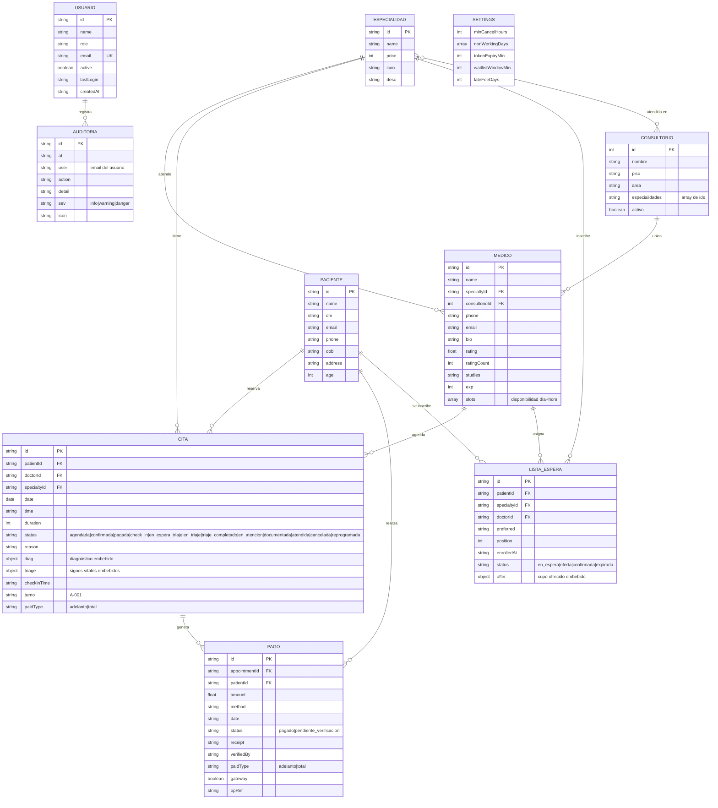

# Modelo Entidad-Relación (MER) — SGCM-CMAS

Diagrama entidad-relación del prototipo **SGCM-CMAS** (gestión de citas médicas, Ayacucho). Documenta las entidades, atributos y relaciones que se implementan en `src/data/mock.js` y se exponen desde `src/context/AppContext.jsx`.

> **Nota de implementación:** el prototipo no usa una base de datos real. Las entidades son **colecciones en memoria** (arrays de objetos en `mock.js`) y solo las citas persisten en `localStorage` (`procitas-appointments-v1`). Las claves foráneas son referencias por id (o por email, en auditoría) sin integridad física. Las cardinalidades reflejan el modelo conceptual que una base de datos real debería implementar.

---

## 1. Diagrama ER

---

## 2. Entidades

| Entidad | Descripción | Fuente | Persistencia |
|---|---|---|---|
| **USUARIO** | Cuentas del sistema con rol (`paciente`, `medico`, `enfermera`, `recepcionista`, `administrador`). | `USERS` | No persiste |
| **PACIENTE** | Datos personales de los pacientes. El paciente con sesión es `ME` (Julia Mamani, p1). | `PATIENTS` | No persiste |
| **MEDICO** | Profesionales con especialidad, consultorio asignado y grilla `slots` de disponibilidad (día + franja de 30 min). | `DOCTORS` | No persiste |
| **ESPECIALIDAD** | Catálogo de servicios con precio. | `SPECIALTIES` | No persiste |
| **CONSULTORIO** | Espacios físicos con piso, área y especialidades atendidas (array). El Consultorio 5 está inactivo. | `CONSULTORIOS` | No persiste |
| **CITA** | Cita médica con estado del ciclo de vida, diagnóstico y triaje **embebidos**. | `INITIAL_APPOINTMENTS` | **Sí — `localStorage`** |
| **PAGO** | Pagos registrados (caja o pasarela simulada), con abono 50% o total. | `INITIAL_PAYMENTS` | No persiste |
| **LISTA_ESPERA** | Inscripciones del paciente a la lista de espera de cupos liberados, con oferta **embebida**. | `INITIAL_WAITLIST` | No persiste |
| **AUDITORIA** | Eventos de seguridad y operaciones sensibles. `user` guarda el email del usuario (desnormalizado). | `AUDIT_LOG` | No persiste |
| **SETTINGS** | Reglas de negocio configurables (singleton de una sola fila). | `settings` en `AppContext.jsx` | No persiste |

---

## 3. Relaciones y cardinalidades

| Relación | Cardinalidad | Clave foránea | Regla |
|---|---|---|---|
| PACIENTE → CITA | 1 a N | `Cita.patientId` | Un paciente puede reservar muchas citas. |
| MEDICO → CITA | 1 a N | `Cita.doctorId` | Un médico tiene muchas citas en su agenda. |
| ESPECIALIDAD → CITA | 1 a N | `Cita.specialtyId` | Cada cita corresponde a una especialidad. |
| ESPECIALIDAD → MEDICO | 1 a N | `Medico.specialtyId` | Un médico pertenece a una especialidad. |
| CONSULTORIO → MEDICO | 1 a N | `Medico.consultorioId` | Un consultorio aloja a varios médicos. |
| ESPECIALIDAD ↔ CONSULTORIO | N a M | `Consultorio.especialidades[]` | Un consultorio atiende varias especialidades y una especialidad puede estar en varios consultorios (en el prototipo es un **array**, en una BD real sería una tabla intermedia). |
| CITA → PAGO | 1 a N | `Pago.appointmentId` | Una cita puede tener varios pagos (p. ej. abono 50% + saldo en caja). |
| PACIENTE → PAGO | 1 a N | `Pago.patientId` | Un paciente realiza muchos pagos. |
| PACIENTE → LISTA_ESPERA | 1 a N | `Lista_Espera.patientId` | Un paciente puede inscribirse en varias listas de espera. |
| ESPECIALIDAD → LISTA_ESPERA | 1 a N | `Lista_Espera.specialtyId` | Cada inscripción apunta a una especialidad. |
| MEDICO → LISTA_ESPERA | 1 a N | `Lista_Espera.doctorId` | Cada inscripción apunta a un médico preferido. |
| USUARIO → AUDITORIA | 1 a N | `Auditoria.user` (email) | Cada evento de auditoría es generado por un usuario (referencia por email, sin FK estricta). |
| SETTINGS | singleton | — | Una única fila de configuración global. |

---

## 4. Objetos embebidos (no entidades separadas en el prototipo)

En un modelo normalizado real, estos objetos embebidos serían entidades o tablas propias:

| Objeto | Contenido | Entidad sugerida |
|---|---|---|
| `Cita.diag` | `{ dx, notes }` | **DIAGNOSTICO** |
| `Cita.triage` | `{ pa, temp, fc, peso, talla, motivo, alergias, observaciones, nurseName, at }` | **TRIAGE** |
| `Cita.turno` | `A-001` (asignado en el check-in presencial) | Atributo de CITA (o **TURNO**) |
| `Medico.slots` | `[{ day, start, end }]` | **DISPONIBILIDAD** |
| `Lista_Espera.offer` | `{ date, time, expiresAt, confirmWindowMin }` | **OFERTA_CUPO** |
| `Consultorio.especialidades[]` | ids de especialidad | **CONSULTORIO_ESPECIALIDAD** (N a M) |

---

## 5. Notas del prototipo

- **Sin integridad referencial**: las FKs se resuelven por id en tiempo de ejecución (`findPatient`, `findDoctor`, `findSpecialty`, `findConsultorio` en `src/utils/helpers.js`). Una cita con un `doctorId` inexistente simplemente no muestra médico.
- **Persistencia parcial**: solo `CITA` se guarda en `localStorage`. El resto de colecciones vuelven al mock al recargar.
- **Paciente demo con sesión**: el usuario autenticado como paciente (`ME`) coincide con `USERS[0]` (u1) y `PATIENTS[0]` (p1); en un sistema real PACIENTE y USUARIO se vincularían con una FK (`usuarioId`).
- **Turnos de la cola**: `turno` se asigna en el check-in presencial con `nextTurno` y la cola se ordena con `turnoOf`/`queuedToday` (`AppContext.jsx`); los turnos se derivan de la fecha del día de operación (`TODAY = '2026-08-05'`).
- **Estados de cita**: el atributo `status` sigue el flujo `agendada → pagada → check_in/en_espera_triaje → en_triaje → triaje_completado → en_atencion → documentada`, con ramas `cancelada`, `reprogramada` y `atendida` (ver sección 9 del `README.md`).
